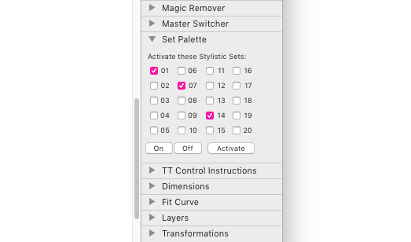

# SetPalette

Glyphs.app palette for toggling stylistic sets in Edit view. Thanks to Marcus Sterz for the idea.

### Installation

1. Go to *Window > Plugin Manager.*
2. Look for *Set Palette*, and click the *Install* button next to it.
3. Restart Glyphs.

### Usage Instructions

1. Open an Edit tab with text in it.
2. Click the checkboxes corresponding to the stylistic sets you want to activate. Click *On* to activate all, and *Off* to deactivate all sets. If the font has the corresponding stylistic sets in its OpenType features, they should immediately be triggered.
3. After switching to a new tab, click *Activate* to apply the current choice of sets to the current Edit tab.

### Requirements

The plug-in works in Glyphs 2.5.2 in High Sierra. I can only test it in current app and OS versions, and perhaps it works on earlier versions too.

### License

Copyright 2018 Rainer Erich Scheichelbauer (@mekkablue).
Based on sample code by Georg Seifert (@schriftgestalt) and Jan Gerner (@yanone).

Licensed under the Apache License, Version 2.0 (the "License");
you may not use this file except in compliance with the License.
You may obtain a copy of the License at

http://www.apache.org/licenses/LICENSE-2.0

See the License file included in this repository for further details.
